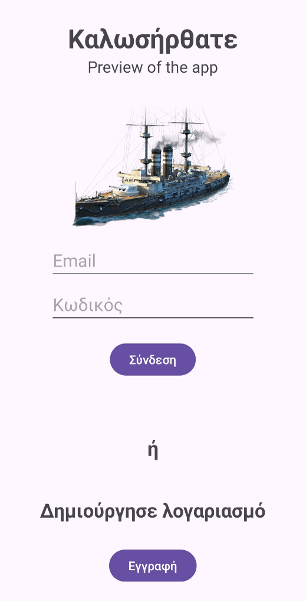
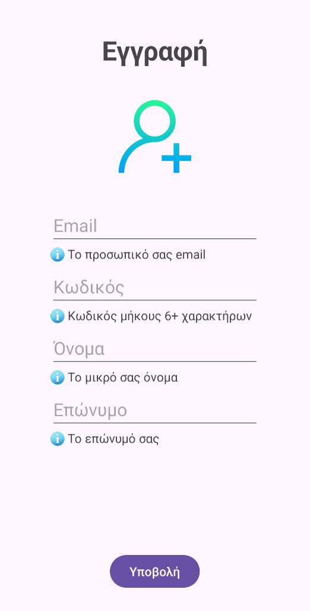
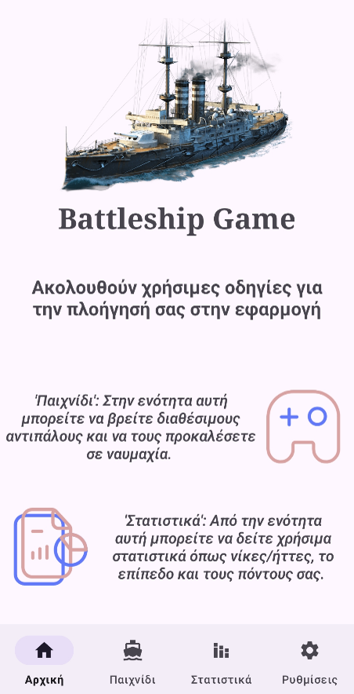
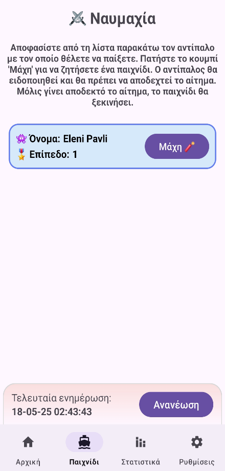
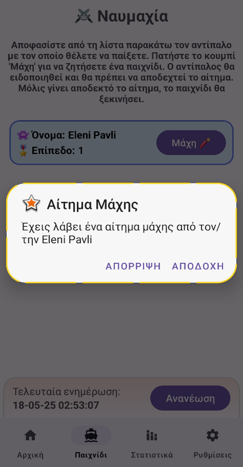
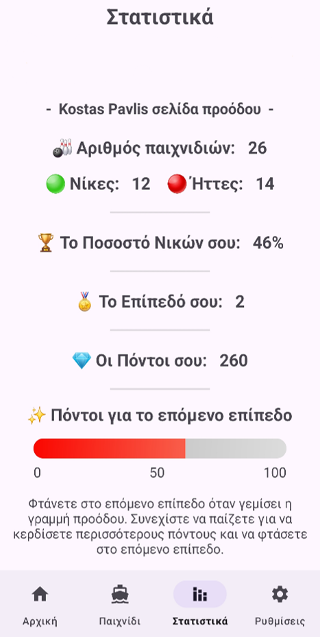
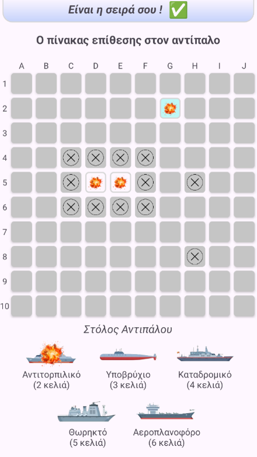
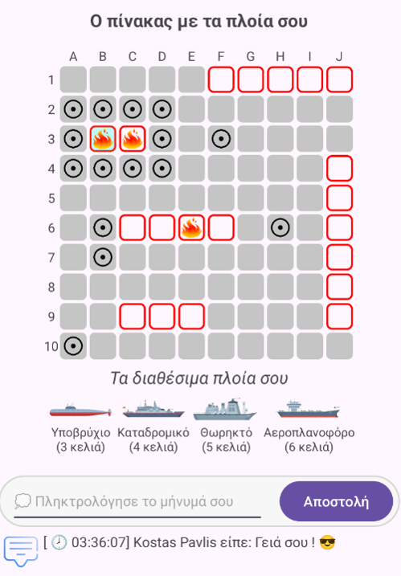

# ⚓ Battleship Game – Android App

**Battleship Game is a multiplayer mobile application developed in Java for Android as part of my undergraduate thesis at the University of Piraeus.**

> ℹ️ This project is not open source and does not grant any usage rights.
> For usage terms and legal information, see [Code Ownership & Usage Terms](#-code-ownership--usage-terms).

## 📖 Overview

This mobile app is a turn-based strategy game inspired by the timeless naval board game. Players place their fleets, challenge opponents, and engage in tactical battles while tracking their progress through detailed statistics and rankings. The app features a clean, intuitive interface, multilingual support, and seamless real-time gameplay powered by Firebase.

## 📱 Features

- 🔐 **User Authentication** – Login, registration, and password management  
- ⚔️ **Real-Time Matchmaking** – Challenge players and receive battle requests  
- 📊 **Game Statistics** – Track wins, losses, win percentage, level, and points  
- 🧭 **Interactive Game Boards** – Grid-based ship placement and attack interface  
- 🌍 **Bilingual Interface** – Greek and English language support  
- 🧑‍💼 **Profile Management** – Update personal info and change password  
- 🎨 **System Settings** – Theme selection (Light/Dark/Default) and language preferences  
- 🏆 **Leaderboard** – View top players ranked by win percentage

## 🛠️ Technologies Used

- Java _as core development language_
- Firebase Authentication _for secure login and registration_
- Firebase Realtime Database _for user and game data management_ 
- Material Design Components _for UI/UX styling_  
- Multilingual Support _with locale-based string resources (Greek & English & Italian)_

## 🎯 Purpose

The purpose of this application is to showcase the integration of real-time multiplayer mechanics within a mobile environment using Firebase technologies. It was developed as part of my undergraduate thesis to demonstrate advanced Android development skills, bilingual UI/UX design, and secure user authentication. The project also reflects my academic journey and passion for impactful software engineering, aiming to deliver a polished, engaging experience while laying the groundwork for future enhancements in mobile game development. **It is developed solely for academic and research purposes.**

## 📚 Official Documentation

This repository includes the official PDF of my undergraduate thesis, providing a comprehensive technical overview of the project.  
It includes explanations of the code structure, key functions, and execution flow.

👉🏼 [Official Documentation (in greek)](project_resources/docs/Documentation_gr.pdf)

## 🧰 Prerequisites

- **Android Studio** (latest stable version)
- **Java SDK** (version 8 or higher)
- Firebase Project with:
   - **Firebase Authentication**
   - **Firebase Realtime Database**
- **Internet connection** for real-time features

## 📦 Installation

1. Clone the repository (or download and decompress the ZIP file):
   ```bash
   git clone https://github.com/kpavlis/battleship-mobile-game.git
   cd battleship-mobile-game

2. (Coming soon...)


## 📸 Screenshots

**_App Screens:_**  
> 
> 
> 
> 
> 
> 
> 
> 


# 🔒 Code Ownership & Usage Terms

This project was created and maintained by Konstantinos Pavlis (@kpavlis).

🚫 **Unauthorized use is strictly prohibited.**  
No part of this codebase may be copied, reproduced, modified, distributed, or used in any form without **explicit written permission** from the owner.

Any attempt to use, republish, or incorporate this code into other projects—whether commercial or non-commercial—without prior consent may result in legal action.

For licensing inquiries or collaboration requests, please contact via email: konstantinos1125 _at_ gmail.com .

© 2025 Konstantinos Pavlis. All rights reserved.
